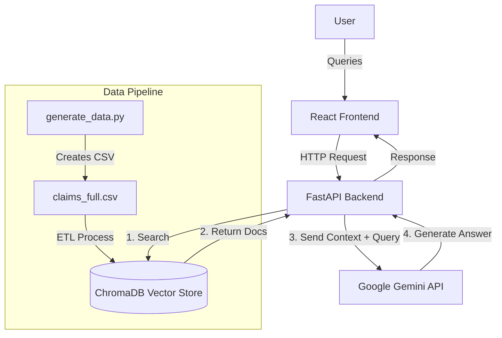
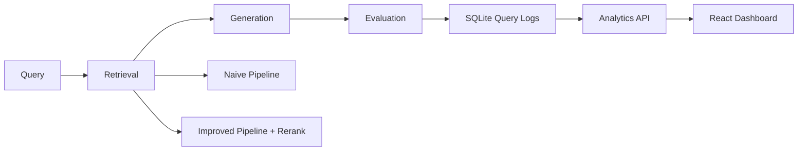

# 🏥 Claims Query Assistant


A robust **RAG (Retrieval-Augmented Generation)** application designed to revolutionize how insurance claims data is queried. By combining the power of **Google Gemini** LLM with **ChromaDB** vector search, this assistant provides instant, accurate, and context-aware answers to complex questions about claim statuses, denial reasons, and provider details.

---

## 🌟 Key Features

- **🧠 Advanced RAG Architecture**: Retrieves relevant claims data using semantic search and generates natural language answers.
- **💬 Context-Aware Chat**: Understands follow-up questions and maintains context (via the LLM's reasoning on retrieved docs).
- **⚡ High-Performance Backend**: Built with **FastAPI** for asynchronous request handling and speed.
- **🎨 Modern, Responsive UI**: Developed with **React**, **Vite**, and **Tailwind CSS**, featuring smooth animations (Framer Motion).
- **📊 Automated Data Pipeline**:
  - **Data Generation**: Script to create realistic dummy data (Patients, Doctors, Claims).
  - **ETL Process**: Automated extraction, transformation, and loading of data into the vector store.
- **🛡️ Secure & Scalable**: Environment-based configuration and modular architecture.

---

## 🏗️ Architecture



---

## 📈 RAG Evaluation Dashboard Architecture

The system now includes a full evaluation pipeline with query logging and dashboard analytics.



### Backend modules

- `backend/app/rag/`: Retrieval, generation, and dual pipeline orchestration (`naive`, `improved`).
- `backend/app/evaluation/`: Metrics, evaluator, schemas, SQLite storage, evaluation routes.
- `backend/app/api/`: Chat API route integrated with per-query evaluation logging.

### Evaluation metrics

- Accuracy
- Faithfulness
- Hallucination Rate
- Context Relevance
- Response Time (latency)
- Confidence Score

`confidence = (faithfulness + context_relevance) / 2`

### Evaluation storage

SQLite table: `query_logs`

- `query`, `retrieved_docs`, `answer`
- `accuracy`, `faithfulness`, `hallucination`, `context_relevance`, `confidence`
- `latency`, `timestamp`, `model_version`, `pipeline`, `metadata_json`

---

## 🛠️ Tech Stack

### **Backend**

- **Core**: `FastAPI`, `Uvicorn`
- **AI/ML**: `google-generativeai` (Gemini), `sentence-transformers`, `chromadb`
- **Data Processing**: `pandas`, `faker`
- **Utilities**: `python-dotenv`

### **Frontend**

- **Core**: `React 18`, `TypeScript`, `Vite`
- **Styling**: `Tailwind CSS`, `Lucide React` (Icons)
- **Animation**: `Framer Motion`
- **State/Network**: `Axios`

---

## 🚀 Getting Started

### Prerequisites

- **Python 3.8+**
- **Node.js 16+** & **npm**
- **Google Gemini API Key** (Get one [here](https://aistudio.google.com/app/apikey))

### 1. Clone the Repository

```bash
git clone https://github.com/prasomjain/claim-query-assistant.git
cd claim-query-assistant
```

### 2. Backend Setup

1.  **Navigate to the backend directory:**

    ```bash
    cd backend
    ```

2.  **Create and activate a virtual environment:**

    ```bash
    python -m venv venv
    # Windows
    venv\Scripts\activate
    # Mac/Linux
    source venv/bin/activate
    ```

3.  **Install dependencies:**

    ```bash
    pip install -r requirements.txt
    ```

4.  **Configure Environment Variables:**
    Create a `.env` file in the `backend` folder:

    ```env
    GEMINI_API_KEY=your_actual_api_key_here
    ```

5.  **Generate Dummy Data (Optional but Recommended):**
    This script creates `data/claims_full.csv` with realistic test data.

    ```bash
    python scripts/generate_data.py
    ```

6.  **Start the Server:**

    ```bash
    uvicorn app.main:app --reload --host 0.0.0.0 --port 8000
    ```

    _The API will be available at `http://localhost:8000`._

7.  **Optional: install evaluation research libraries**

    ```bash
    pip install -r requirements-eval.txt
    ```

    These are optional and the evaluator will gracefully fallback if unavailable.

8.  **Run benchmark evaluation data generation (optional):**
    ```bash
    python scripts/run_evaluation_benchmark.py
    ```
    This populates evaluation logs for both `naive` and `improved` pipelines.

### 3. Frontend Setup

1.  **Navigate to the frontend directory:**

    ```bash
    cd ../frontend
    ```

2.  **Install dependencies:**

    ```bash
    npm install
    ```

3.  **Start the Development Server:**

    ```bash
    npm run dev
    ```

    _The UI will be available at `http://localhost:5173`._

4.  **Open dashboard route:** - `http://localhost:5173/dashboard`

---

## 🧪 Testing Instructions

### Backend tests

```bash
cd backend
python -m pytest tests -q
```

If local pytest plugins interfere, run:

```bash
PYTEST_DISABLE_PLUGIN_AUTOLOAD=1 python -m pytest tests -q
```

### Frontend validation

```bash
cd frontend
npm run build
```

---

## 🔌 Evaluation APIs

- `GET /evaluation/metrics`
- `GET /evaluation/logs`
- `GET /evaluation/hallucination-trend`
- `GET /evaluation/model-comparison`
- `GET /evaluation/latency-distribution`
- `GET /evaluation/confidence-scores`

Example summary response from `/evaluation/metrics`:

```json
{
  "accuracy": 0.89,
  "faithfulness": 0.85,
  "hallucination_rate": 0.07,
  "context_relevance": 0.83,
  "avg_latency": 1.2,
  "confidence": 0.84,
  "total_queries": 120
}
```

---

---

## 💡 Usage Guide

### Initial Data Loading (ETL)

Before asking questions, you need to populate the vector database.

1.  Open the frontend application.
2.  Look for a **"Trigger ETL"** button or use the API directly:
    - **POST** `http://localhost:8000/trigger-etl`
3.  Wait for the process to complete (check backend logs for "ETL finished").

### Example Queries

Try asking the chatbot questions like:

- _"Show me all denied claims for diabetes."_
- _"Why was claim CLM-10045 denied?"_
- _"List the top 5 claims by amount."_
- _"What is the coverage status for patient John Doe?"_

---

## 📂 Project Structure

```
claim-query-assistant/
├── backend/
│   ├── app/
│   │   ├── main.py                 # FastAPI entry point
│   │   ├── etl.py                  # Data ingestion pipeline
│   │   ├── api/
│   │   │   └── chat_routes.py      # Chat + ETL API routes
│   │   ├── rag/
│   │   │   ├── retriever.py        # Chroma retrieval
│   │   │   ├── generator.py        # Gemini generation
│   │   │   └── pipeline.py         # Naive vs improved RAG orchestration
│   │   └── evaluation/
│   │       ├── metrics.py          # Metric computations
│   │       ├── evaluator.py        # Optional RAGAS/DeepEval integration
│   │       ├── storage.py          # SQLite logging + analytics queries
│   │       ├── schemas.py          # Typed request/response schemas
│   │       └── routes.py           # Evaluation analytics API
│   ├── scripts/
│   │   └── generate_data.py # Dummy data generator
│   ├── data/                # Stores generated CSVs
│   ├── chroma_db/           # Vector database storage
│   ├── requirements.txt      # Base Python dependencies
│   ├── requirements-eval.txt # Optional research-eval dependencies
│   └── tests/                # Metrics/API tests
│
├── frontend/
│   ├── src/
│   │   ├── components/
│   │   │   └── dashboard/            # Dashboard chart components
│   │   ├── pages/
│   │   │   ├── ChatPage.tsx          # Chat UI
│   │   │   └── DashboardPage.tsx     # Evaluation dashboard page
│   │   ├── api.ts                    # Chat + evaluation API clients
│   │   └── App.tsx                   # Route shell + top nav
│
└── README.md                # Project documentation
```

---

## 🔧 Troubleshooting

- **Error: `GEMINI_API_KEY not found`**
  - Ensure you created the `.env` file in the `backend` directory and it contains your valid key.
- **Error: `Connection refused`**
  - Make sure the backend server is running on port 8000.
- **Empty Responses**
  - Ensure you have run the **ETL process** at least once to populate the database.

---

## 🤝 Contributing

Contributions are welcome! Please fork the repository and submit a Pull Request.

1.  Fork the Project
2.  Create your Feature Branch (`git checkout -b feature/AmazingFeature`)
3.  Commit your Changes (`git commit -m 'Add some AmazingFeature'`)
4.  Push to the Branch (`git push origin feature/AmazingFeature`)
5.  Open a Pull Request

## 📄 License

Distributed under the MIT License. See `LICENSE` for more information.
